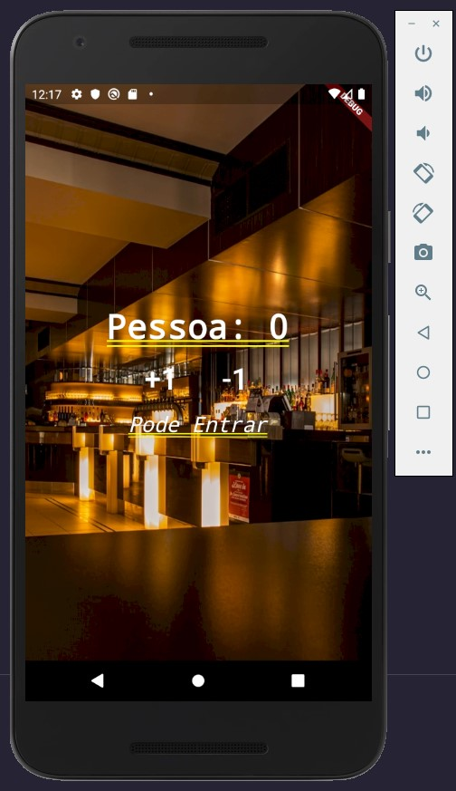

# Contador de pessoas

Projeto feito totalmente em flutter, framework da linguagem dart.

****
### **Explicação App**

O aplicativo tem por finalidade fazer a contagem de pessoas, que ao apertar nos botões
**+1** e **-1** vai aumentando e diminuindo.

* Quando está em **0 Pessoas** ele diz que pode entrar, já que ainda tem espaço de pessoas.

* Quando está a cima de **10 Pessoas** foi estipulado que o lugar estaria cheio, e não suportaria tantas pessoas assim no estabelecimento.

* Quando está com quantidade **negativa** de pessoas, teve uma brincadeira feita, dizendo: **Aliens ??**

****

# **Print da Aplicação**

